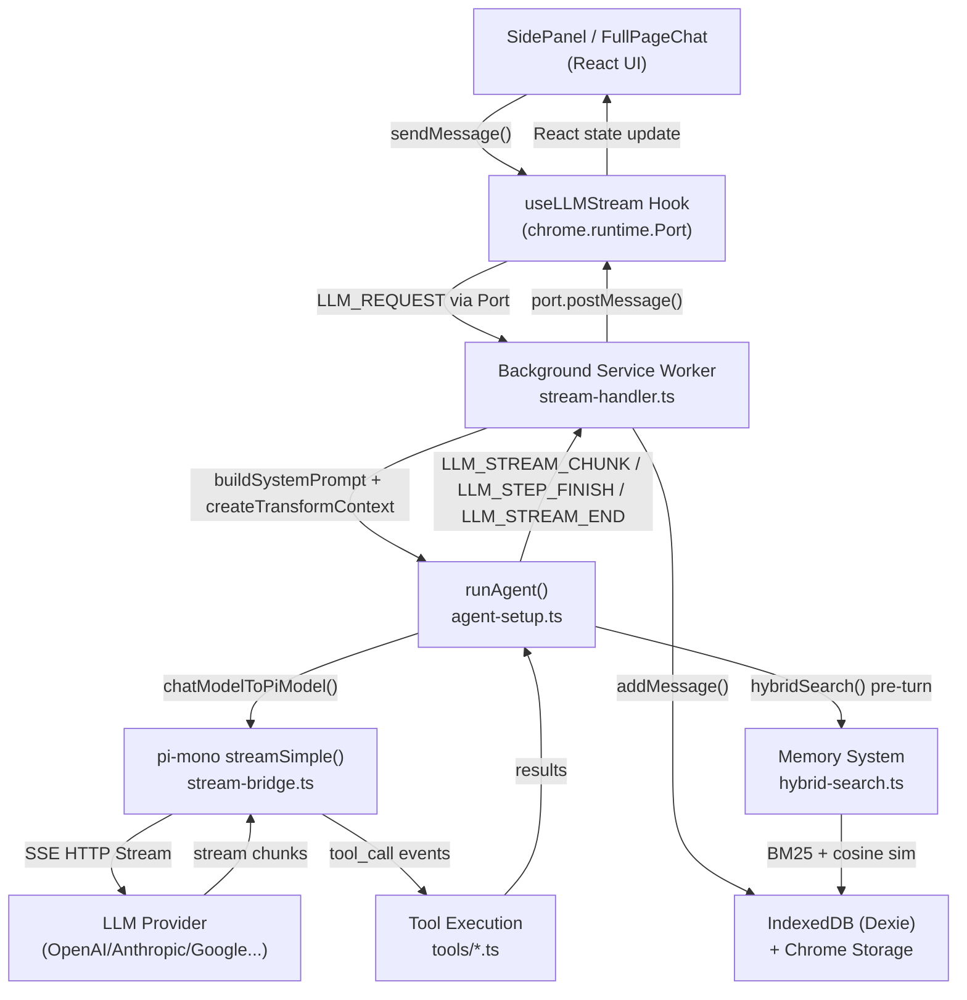
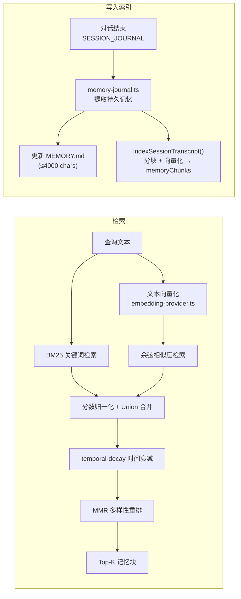
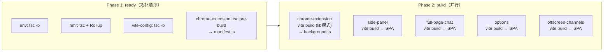

# ChromeClaw 技术方案文档

## 1. 项目定位

ChromeClaw 是一个 **Chrome/Firefox 浏览器扩展**，核心能力：

- 侧边栏 AI 聊天（支持 OpenAI、Anthropic、Google、OpenRouter、自定义模型）
- 多 Agent 人格，每个 Agent 有独立工作区文件、记忆、模型配置
- 工具调用（浏览器自动化、网页搜索、代码执行、文件管理、Google 服务等）
- Telegram/WhatsApp 消息桥接（频道系统）
- 混合记忆检索（BM25 + 向量嵌入）
- 定时任务（Cron）
- TTS/STT 语音支持

用户自带 API Key，无需登录代理。

---

## 2. 仓库结构（Monorepo）

Turborepo 编排的扁平 monorepo，5 个独立 Vite 构建产物拼装成一个 Chrome 扩展：

```
chromeclaw/
├── chrome-extension/       # Background Service Worker（核心后端逻辑）
├── pages/
│   ├── side-panel/         # 主聊天 UI（侧边栏叠加模式）
│   ├── full-page-chat/     # 全页聊天（推送侧边栏模式）
│   ├── options/            # 设置页
│   └── offscreen-channels/ # Offscreen 页（Baileys/ONNX/TTS/本地模型）
├── packages/
│   ├── shared/             # 核心类型 + useLLMStream Hook
│   ├── storage/            # Chrome Storage + IndexedDB (Dexie.js)
│   ├── ui/                 # 所有 React 组件（shadcn/ui + 自定义）
│   ├── config-panels/      # Options 页 Tab 面板定义
│   ├── env/                # 构建时环境变量
│   ├── vite-config/        # 共享 Vite 配置工厂
│   ├── hmr/                # 自定义 WebSocket HMR
│   ├── i18n/               # 国际化
│   ├── skills/             # Skill 模板加载
│   └── ...                 # tsconfig, tailwind, zipper, module-manager
```

---

## 3. 整体数据流



频道消息（Telegram/WhatsApp）和 Cron 任务最终都走同一条 `runAgent()` 管道。

---

## 4. Background Service Worker 详解

入口：[`chrome-extension/src/background/index.ts`](../chrome-extension/src/background/index.ts)

### 4.1 消息路由

- `chrome.runtime.onConnect` → 监听 `'llm-stream'` Port → `handleLLMStream(port, msg)`
- `chrome.runtime.onMessage` → 路由到 Channels / Cron / STT / TTS / 本地模型等
- `chrome.alarms.onAlarm` → Cron 定时器 / 频道被动轮询 / Offscreen 看门狗

### 4.2 LLM 流式管道（agents/）

| 文件 | 作用 |
|---|---|
| `stream-handler.ts` | Port 入口，组装系统提示，触发 Memory flush，调 `runAgent()` |
| `agent-setup.ts` | `runAgent()` 统一入口，解析模型，加载工具，3次重试（compaction/截断） |
| `model-adapter.ts` | `chatModelToPiModel()` — ChatModel → pi-mono Model，路由到各 Provider API |
| `stream-bridge.ts` | 创建 pi-mono streamFn（实际 HTTP 流） |
| `agent.ts` + `agent-loop.ts` | Agent 状态机，内层工具调用循环 + 外层 follow-up 循环 |
| `message-adapter.ts` | ChatMessage ↔ pi-ai Message 格式互转 |
| `tool-loop-detection.ts` | 滚动窗口检测重复工具调用（warn/block） |

### 4.3 Context 管理（context/）

- **`adaptive-compaction.ts`**：估算 token 数，接近上限时触发压缩
- **`compaction.ts`**：summary-based（LLM 摘要旧上下文）或滑动窗口截断
- **`history-sanitization.ts`** + 若干 sanitizer：清理不兼容消息格式
- **`tool-result-truncation.ts`**：裁剪超大工具结果

### 4.4 工具系统（tools/）

工具注册表 `tools/index.ts` 导出 `ALL_TOOLS`，`getAgentTools()` 按 Agent 配置过滤启用：

| 工具 | 功能 |
|---|---|
| `browser` | Tab 控制、DOM 检查 |
| `debugger` | Chrome DevTools Protocol |
| `deep_research` | 多轮迭代网络研究 |
| `web_search` / `web_fetch` | 搜索 + 抓取（含 JS 渲染） |
| `execute_js` | 在当前 Tab 执行 JS |
| `memory_*` | 记忆读/写/检索（BM25+向量） |
| `workspace_*` | 工作区文件读写 |
| `subagent` / `subagent_kill` | 嵌套 headless Agent 子任务 |
| `scheduler` | 创建/管理定时任务 |
| `create_document` | 创建 Artifact（代码/文本/表格） |
| `google_*` | Gmail / Calendar / Drive |
| `agents_list` | 列出所有 Agent 人格 |

每个 Agent 还可配置**自定义工具**（通过 `execute_js` 动态注入）。

### 4.5 记忆系统（memory/）



- BM25 索引由 `memory-sync.ts` 保持与 IndexedDB 同步
- 向量嵌入结果缓存于 `embeddingCache` 表（LRU）
- MMR 参数可调（`lambda` 控制相关性/多样性权衡）

### 4.6 频道系统（channels/）

支持 Telegram（Bot API 轮询）和 WhatsApp（Baileys WebSocket，在 Offscreen 页运行）：

```
Alarm（被动轮询） / Offscreen 推送（主动 WS）
  → poller.ts → getUpdatesShortPoll()
  → message-bridge.ts → normalize + dedup + allowlist 过滤
  → agent-handler.ts → withChatLock() 串行处理
      → runAgent()（含 Telegram 实时 draft 流式编辑）
      → adapter.sendMessage() / sendVoiceMessage()
```

- Telegram 支持实时 draft 流（每 500ms 编辑消息）
- WhatsApp 通过 Offscreen 页的 Baileys socket 通信
- 两者均支持 TTS 语音回复

### 4.7 定时任务（cron/）

- `CronService` → 单一 Chrome Alarm（1分钟精度）
- 到期任务 → `executeScheduledTask()` → `runHeadlessLLM()` 或注入聊天消息
- 运行日志存 `taskRunLogs` 表，可在 Options 页查看

---

## 5. 数据存储

### 5.1 Chrome Storage（轻量配置）

`createStorage()` 工厂，支持跨页面实时订阅：

| Key | 内容 |
|---|---|
| `settingsStorage` | 主题、语言 |
| `customModelsStorage` | 所有模型列表 |
| `selectedModelStorage` | 当前选中模型 ID |
| `activeAgentStorage` | 当前 Agent ID |
| `toolConfigStorage` | 工具启用配置 |
| `ttsConfigStorage` / `sttConfigStorage` | 语音配置 |
| `embeddingConfigStorage` | 嵌入模型配置 |

### 5.2 IndexedDB（Dexie.js，数据库名 `chromeclaw`，v13）

| 表 | 用途 |
|---|---|
| `agents` | Agent 人格配置（模型、工具、身份） |
| `chats` | 对话列表（含 token 统计、压缩信息） |
| `messages` | 消息（parts: text/reasoning/tool-call/file） |
| `artifacts` | 代码/文本/表格/图片 Artifact |
| `workspaceFiles` | AGENTS.md、SOUL.md、MEMORY.md 等系统提示文件 |
| `memoryChunks` | 记忆分块（BM25索引 + 向量嵌入） |
| `scheduledTasks` | 定时任务配置 |
| `taskRunLogs` | 定时任务执行日志 |
| `embeddingCache` | 向量嵌入 LRU 缓存（provider:model:hash） |

**迁移历史（v1→v13）**

| 版本 | 变更 |
|---|---|
| v1 | 初始表（chats, messages, artifacts） |
| v2 | chats 新增 token 统计字段 |
| v3 | 新增 workspaceFiles 表 |
| v7 | 新增 memoryChunks 表（BM25 检索） |
| v8 | chats 新增 `source` 索引（频道来源对话） |
| v9 | 新增 scheduledTasks + taskRunLogs（Cron 系统） |
| v10 | 新增 agents 表，所有表加 agentId 索引，回填 `agentId='main'` |
| v11 | agents 迁移 `emoji → identity` 对象，`selectedModelId → model.primary` |
| v12 | 新增 embeddingCache 表，memoryChunks 新增可选向量字段 |
| v13 | memoryChunks 新增 `chatId` 索引（transcript 索引） |

---

## 6. 前端 UI 架构

### 6.1 三个页面的关系

- **SidePanel**（overlay 侧边栏）和 **FullPageChat**（push 侧边栏）共用同一个 `<Chat>` 组件，逻辑几乎相同
- **FullPageChat** 额外内嵌 `ConfigPanelContent`（设置面板直接在页面内），无需单独打开 Options 页
- **Options** 独立标签页，使用 `CONFIG_TAB_GROUPS` 定义三组标签（Control / Agent / Settings）

### 6.2 Chat 组件核心

```
Chat（packages/ui）
├── useLLMStream Hook        ← Port 通信、消息状态管理
├── ChatHeader               ← 标题、模型选择、Agent 切换
├── Messages                 ← 虚拟化消息列表
│   └── Message              ← text/reasoning/tool-call/file 渲染
├── ChatInput                ← 输入框、附件、提交/停止
├── ArtifactPanel            ← 侧抽屉（Monaco/Markdown/Sheet/Image 编辑器）
└── SubagentProgressCard     ← 子 Agent 实时进度
```

### 6.3 跨页面通信

| 方式 | 用途 |
|---|---|
| `chrome.runtime.Port ('llm-stream')` | 每次对话的流式消息传输 |
| `chrome.runtime.sendMessage` | SESSION_JOURNAL（触发记忆写入）、SUBAGENT_STOP |
| `chrome.runtime.onMessage` 监听 | CHANNEL_STREAM_START/END、CRON_CHAT_INJECT、SUBAGENT_PROGRESS |
| Chrome Storage `.subscribe()` | 模型/主题/Agent 切换实时同步所有页面 |

### 6.4 Options 设置页 Tab 结构

- **Control 组**：Channels（频道配置）、Cron Jobs（定时任务）、Sessions（历史对话）、Usage（Token 用量）
- **Agent 组**：Agents（人格管理）、Tools（工具开关）、Skills（技能模板）
- **Settings 组**：General（主题语言）、Models（API Key/模型管理）、Actions（推荐操作）、Logs（日志查看）

---

## 7. 构建系统

### 7.1 Turborepo 两阶段构建



### 7.2 特殊构建机制

- **动态 Manifest**：`manifest.ts` → `manifest.js`（ready 阶段编译）→ `makeManifestPlugin` 在 Vite bundle 时动态 `import()` 并序列化为 `dist/manifest.json`。Firefox 构建时自动剥离 `sidePanel` 等不兼容字段
- **Node 模块 Stub**：`shimNodeModules` 将 `@aws-sdk/*`、`undici` 等 Node 专有依赖替换为空 stub，避免浏览器 bundle 报错
- **OAuth Stub**：`shimPiAiOAuth` 剔除 pi-ai 的 base64 混淆 OAuth 代码，避免 Chrome Web Store 审核拒绝
- **自定义 HMR**：Chrome 扩展无法使用 Vite 内置 HMR，改用 WebSocket（端口 8081）三方协议：Vite 插件发 `BUILD_COMPLETE` → Reload Server 广播 `DO_UPDATE` → 浏览器端 IIFE 调 `chrome.runtime.reload()` 或 `window.location.reload()`

**Dev vs Prod 构建对比**

| 方面 | Dev (`CLI_CEB_DEV=true`) | Prod (`CLI_CEB_DEV=false`) |
|---|---|---|
| Source maps | 开启 | 关闭 |
| 代码压缩 | 关闭 | 开启 |
| `emptyOutDir` | false（增量） | true（全量清理） |
| Rollup watch | 开启（chokidar） | 关闭 |
| HMR 注入 | 所有 chunk 预置 | 无 |
| `refresh.js` content script | 注入 manifest | 不存在 |

### 7.3 关键依赖

| 依赖 | 用途 |
|---|---|
| `@mariozechner/pi-ai` + `@mariozechner/pi-agent-core` | LLM 流式调用底层（pi-mono） |
| `dexie` | IndexedDB ORM |
| `react` 19 + `typescript` strict | UI 框架 |
| `tailwindcss` + `shadcn/ui` | 样式系统 |
| `@whiskeysockets/baileys` | WhatsApp WebSocket 客户端（Offscreen 页） |
| `@huggingface/transformers`（ONNX） | 本地 STT/TTS 模型 |
| `@vitejs/plugin-react-swc` | React 快速编译（SWC） |
| `turbo` | Monorepo 任务编排（并发 12） |
| `fflate` | ZIP 打包（zipper 包） |

---

## 8. 关键设计决策

1. **Service Worker 常驻**：使用 24s 保活 Alarm 防止 Chrome 在流式传输中途终止 SW
2. **Context Compaction 重试**：`runAgent()` 最多重试 3 次，依次尝试 summary 压缩和 tool-result 截断
3. **每次对话重建系统提示**：`stream-handler.ts` 每轮都调 `buildHeadlessSystemPrompt()`，确保 MEMORY.md 更新立即生效
4. **Offscreen 页懒加载**：Baileys/ONNX/WebGPU 等重型依赖按需 `import()`，避免 Offscreen 页因 polyfill 崩溃
5. **每个 Agent 独立工作区**：workspaceFiles 按 `agentId` 隔离，不同 Agent 有各自的 MEMORY.md、SOUL.md 等
6. **向量嵌入缓存**：以 `provider:model:contentHash` 为 key，避免重复调用嵌入 API
7. **Firefox 兼容**：所有 `sidePanel`、`declarativeNetRequest` 等 Chrome 专有 API 在 Firefox 构建时通过 ManifestParser 剥离
