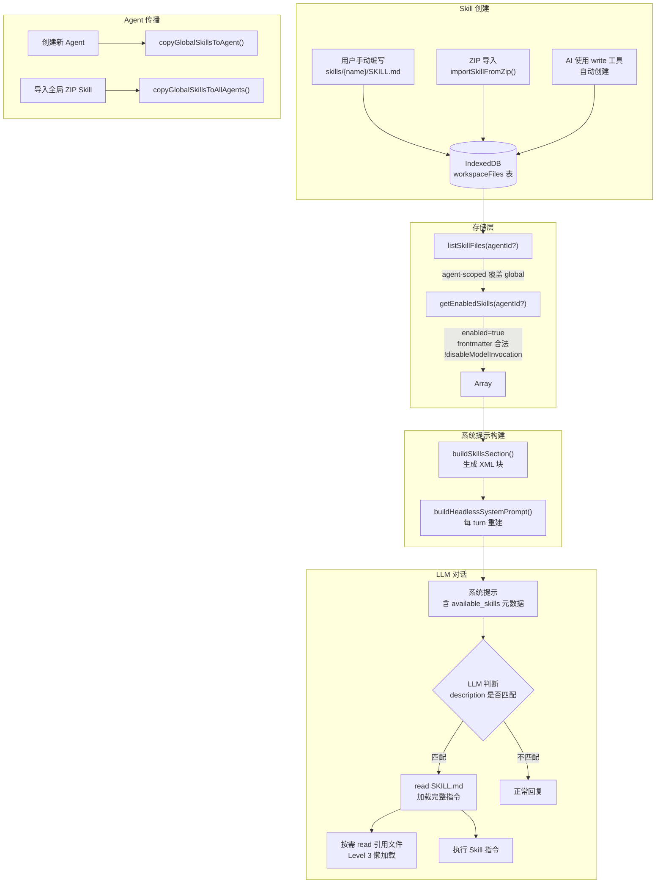

# Skills 技术实现说明

## 1. 概述

**Skills** 是 ULCopilot 扩展的可插拔指令模板系统，允许用户和 AI 将特定任务的程序化知识编码为 Markdown 文件，在对话中按需注入给 LLM。

核心设计目标：

- **低 token 开销**：系统提示只注入元数据（name + description），skill 正文在匹配后才懒加载
- **即时生效**：每个对话轮次重建系统提示，skill 的 enable/disable 无需重启
- **存储统一**：skills 复用 workspace files 的存储层，通过路径约定区分，无独立表
- **Agent 隔离**：每个 agent 维护独立的 skill 集合，支持全局 skill 的 per-agent 覆盖

---

## 2. 包结构

```
packages/skills/
├── lib/
│   ├── skill-parser.ts          # YAML frontmatter 解析器 + SkillMetadata 类型
│   ├── skill-creator/index.ts   # 内置 Skill Creator 的文本内容
│   ├── tool-creator/index.ts    # 内置 Tool Creator 的文本内容
│   ├── daily-journal/index.ts   # 内置 Daily Journal 的文本内容
│   └── index.ts                 # 统一导出
```

该包没有任何运行时依赖（仅 `@extension/tsconfig` 作为 devDep），以 ES module 方式导出，被 `packages/storage` 和 `packages/config-panels` 消费。

---

## 3. 数据模型

### 3.1 SkillMetadata

定义于 `packages/skills/lib/skill-parser.ts`：

```typescript
interface SkillMetadata {
  name: string;                    // 显示名称，出现在系统提示中
  description: string;             // 触发描述，LLM 根据此判断是否加载
  disableModelInvocation: boolean; // true → 不注入系统提示（对 LLM 不可见）
  userInvocable: boolean;          // false → 用户不可从 UI 手动触发
}
```

对应 YAML frontmatter 字段：

| YAML key | TypeScript 字段 | 必填 | 默认值 |
|---|---|---|---|
| `name` | `name` | 是 | — |
| `description` | `description` | 是 | — |
| `disable-model-invocation` | `disableModelInvocation` | 否 | `false` |
| `user-invocable` | `userInvocable` | 否 | `true` |

### 3.2 DbWorkspaceFile（存储层）

定义于 `packages/storage/lib/impl/chat-db.ts`，skills 使用与普通 workspace 文件完全相同的表结构：

```typescript
interface DbWorkspaceFile {
  id: string;
  name: string;        // 文件路径，如 "skills/daily-journal/SKILL.md"
  content: string;     // 完整 Markdown 文本（含 frontmatter）
  enabled: boolean;    // 是否启用
  owner: 'user' | 'agent';
  predefined: boolean; // true = 内置 skill，不可删除
  createdAt: number;
  updatedAt: number;
  agentId?: string;    // undefined = 全局；有值 = 专属某个 agent
}
```

**"skill-ness" 判断完全依赖 `name` 字段的路径 pattern**，无单独标记列。

---

## 4. Skill 文件 Pattern 与解析器

### 4.1 路径 Pattern

```typescript
const SKILL_FILE_PATTERN = /^skills\/[a-z0-9-]+\/SKILL\.md$/i;

const isSkillFile = (name: string): boolean => SKILL_FILE_PATTERN.test(name);
```

合法路径示例：
- `skills/daily-journal/SKILL.md` ✓
- `skills/my-custom-skill/SKILL.md` ✓
- `skills/daily-journal/references/schema.md` ✗（引用文件，不是 skill 入口）
- `SKILL.md` ✗（不在 skills/ 目录下）

### 4.2 Frontmatter 解析器

`parseSkillFrontmatter(content: string): SkillMetadata | null`

解析器为手写实现（不依赖任何 YAML 库），逻辑如下：

1. 用正则 `/^---\s*\n([\s\S]*?)\n---/` 提取 `---` 分隔的 frontmatter 块
2. 按行遍历，识别 `key: value` 格式（key 仅限 `[a-z0-9-]`）
3. 支持多行值：以空白字符开头的行作为上一个 key 的续行（join 后 trim）
4. boolean 值：`true`/`yes` → `true`，其他 → `false`（大小写不敏感）
5. `name` 和 `description` 任一缺失 → 返回 `null`

---

## 5. 存储层函数

定义于 `packages/storage/lib/impl/chat-storage.ts`。

### 5.1 种子数据

```typescript
const PREDEFINED_FILES = [
  // ...其他 workspace 文件...
  { name: 'skills/daily-journal/SKILL.md', content: DAILY_JOURNAL_SKILL, enabled: false },
  { name: 'skills/skill-creator/SKILL.md', content: SKILL_CREATOR_SKILL, enabled: false },
  { name: 'skills/tool-creator/SKILL.md',  content: TOOL_CREATOR_SKILL,  enabled: false },
];
```

`seedPredefinedWorkspaceFiles(agentId)` 在首次启动（或新建 agent 时）调用，3 个内置 skill 默认 `enabled: false`、`predefined: true`。`predefined: true` 的 skill 不允许删除（storage 层会抛出错误）。

### 5.2 listSkillFiles

```typescript
const listSkillFiles = async (agentId?: string): Promise<DbWorkspaceFile[]>
```

查询逻辑：

- `agentId` 有值：返回该 agent 专属文件 + 无 agentId 的全局文件，按 `name` 去重，**agent-scoped 优先**（覆盖同名全局文件）
- `agentId` 为空：只返回无 agentId 的全局文件

### 5.3 getEnabledSkills

```typescript
const getEnabledSkills = async (
  agentId?: string,
): Promise<Array<{ file: DbWorkspaceFile; metadata: SkillMetadata }>>
```

在 `listSkillFiles` 基础上叠加 4 层过滤：

1. `isSkillFile(file.name)` — 路径符合 pattern
2. `file.enabled === true` — 已启用
3. `parseSkillFrontmatter(file.content) !== null` — frontmatter 合法
4. `!metadata.disableModelInvocation` — 未被标记为隐藏

### 5.4 全局 → Agent 传播

```typescript
copyGlobalSkillsToAgent(agentId: string)  // 新建 agent 时调用
copyGlobalSkillsToAllAgents()             // ZIP 导入全局 skill 后调用
```

将全局（无 agentId）skill 复制为对应 agent 的专属版本，初始 `enabled` 状态与源文件相同。

---

## 6. Agent 作用域规则

```
全局 skills (agentId = undefined)
    ↓ copyGlobalSkillsToAgent
Agent-scoped skills (agentId = "xxx")
```

**覆盖规则**：`listSkillFiles('agent-1')` 的结果中，若存在同名文件，agent-scoped 版本替换全局版本。这允许：

- agent 禁用某个在全局启用的 skill（将 agent-scoped 副本设为 `enabled: false`）
- agent 使用定制化版本的 skill（修改 agent-scoped 副本内容）

全局 skill 本身不受影响。

---

## 7. 系统提示注入

### 7.1 SkillEntry 类型

定义于 `packages/shared/lib/prompts.ts`：

```typescript
interface SkillEntry {
  name: string;
  description: string;
  path: string;   // 即 DbWorkspaceFile.name，如 "skills/daily-journal/SKILL.md"
}
```

注意：skill 正文内容**不**在此传递，系统提示中只有元数据。

### 7.2 buildSkillsSection

生成注入系统提示的 XML 块：

```xml
## Skills (mandatory)

Before replying: scan <available_skills> <description> entries.
- If exactly one skill clearly applies: read its SKILL.md at <location> with `read`, then follow it.
- If multiple could apply: choose the most specific one, then read/follow it.
- If none clearly apply: do not read any SKILL.md.
Constraints: never read more than one skill up front; only read after selecting.

<available_skills>
  <skill>
    <name>Daily Journal</name>
    <description>Maintain structured daily journal entries in agent memory</description>
    <location>skills/daily-journal/SKILL.md</location>
  </skill>
  ...
</available_skills>
```

### 7.3 3-Level 懒加载模式

```
Level 1: 系统提示中的元数据（name + description + location）
         → 每轮对话都在上下文中，token 消耗极低

Level 2: LLM 判断匹配 → 调用 read 工具读取完整 SKILL.md
         → 仅在匹配时消耗 token

Level 3: SKILL.md 正文中可指令 LLM 按需读取引用文件
         → 大型 skill 的参考资料按需加载
```

### 7.4 各 Prompt 模式对 Skills 的处理

| 模式 | Skills 注入 | 适用场景 |
|------|------------|---------|
| `full`（默认） | 包含 | 支持工具调用的标准模型 |
| `web` | 包含（Tooling 部分省略） | Web 访问模式 |
| `local` | 包含 | 本地模型 |
| `minimal` | **不包含** | 轻量级本地模型，上下文受限 |
| `none` | **不包含** | 无系统提示模式 |

---

## 8. 系统提示重建时机

在 `chrome-extension/src/background/agents/stream-handler.ts` 中，每个对话轮次（turn）开始时重建系统提示：

```typescript
// 每轮重建，确保 workspace file / skill 的修改立即反映
const freshSystemPrompt = await buildHeadlessSystemPrompt(modelConfig, currentAgentId);
```

`buildHeadlessSystemPrompt` 定义于 `agent-setup.ts`，完整流程：

```
getEnabledWorkspaceFiles(agentId)   → 用户 workspace 文件
getEnabledSkills(agentId)           → 启用的 skills
  ↓
buildSystemPrompt / buildWebSystemPrompt / buildLocalSystemPrompt
  ↓
完整系统提示字符串（含 <available_skills> 块）
```

---

## 9. Channel 集成

在 `chrome-extension/src/background/channels/agent-handler.ts` 中，Telegram / WhatsApp 消息处理固定使用 `main` agent 的 skills：

```typescript
const skills = await getEnabledSkills('main');
```

当前版本 Channel 不支持 per-channel 的 agent 作用域，统一取 `main` agent。

---

## 10. ZIP 导入流程

`importSkillFromZip` 定义于 `packages/shared/lib/skill-zip-import.ts`：

```
1. 文件大小校验（≤ 1MB）
2. JSZip 解压
3. 查找唯一的 SKILL.md（0 个或 >1 个均报错）
4. parseSkillFrontmatter 校验 frontmatter 合法性
5. 推断 skillDir：
   - 优先使用 zip 顶层目录名（kebab-case 化）
   - 若无顶层目录，回退到 frontmatter name → kebab-case
6. 返回 { name, skillDir: "skills/{name}", files: [{path, content}] }
7. 调用方将所有文件写入 workspaceFiles 表
   路径：skills/{skillDir}/{originalPath}
8. 若为全局 scope，调用 copyGlobalSkillsToAllAgents() 传播到所有 agent
```

---

## 11. UI 层

### 11.1 Skills 配置面板

`packages/config-panels/lib/skill-config.tsx`，属于 **Agent** tab 组（与 Agents、Tools 并列）：

- 通过 `listSkillFiles(agentId?)` 加载所有 skill（含 disabled）
- 显示：ZapIcon + frontmatter `name`（frontmatter 无效时回退为目录名）+ 截断的 `description`
- Toggle ON/OFF：调用 `updateWorkspaceFile({ enabled: !file.enabled })`
- **Agent 上下文特殊处理**：在 agent 视图中切换全局 skill 的状态，会创建 agent-scoped 副本而非修改全局记录
- 导入 ZIP：接受 `.zip` 文件，调用 `importSkillFromZip()` 后批量写入
- 删除（仅非 predefined）：调用 `deleteWorkspaceFilesByPrefix(skillDir)` 删除整个 skill 目录

### 11.2 Agent 配置中的 Skills 子 Tab

`packages/config-panels/lib/agents-config.tsx` 中：

```tsx
<SkillConfig agentId={selectedAgentId} />
```

新建 agent 流程：`seedPredefinedWorkspaceFiles(id)` + `copyGlobalSkillsToAgent(id)`。

### 11.3 首次运行设置（Onboarding）

`packages/ui/lib/first-run-setup.tsx` 第 5 步：通过 `listSkillFiles('main')` 加载内置 skills，引导用户选择要启用的 skill。

### 11.4 Workspace Explorer 中的校验

`packages/ui/lib/workspace-explorer.tsx` 中，重命名 skill 文件时若目标路径不符合 `isSkillFile()`，会显示警告提示。

---

## 12. 架构流程图



---

## 13. 内置 Skills 说明

| Skill | 路径 | 默认状态 | 功能 |
|---|---|---|---|
| Daily Journal | `skills/daily-journal/SKILL.md` | disabled | 维护 `memory/YYYY-MM-DD.md` 结构化日记 |
| Skill Creator | `skills/skill-creator/SKILL.md` | disabled | 指导 LLM 创建新的 skill 文件 |
| Tool Creator | `skills/tool-creator/SKILL.md` | disabled | 指导 LLM 通过 `execute_javascript` 创建自定义工具 |

三个内置 skill 的文本内容以 TypeScript 字符串常量形式 bundle 在 `packages/skills/` 中，在编译时静态打包，不依赖文件系统读取。

---

## 14. 关键设计决策

1. **Skills 即 Workspace Files**：无独立存储表，降低了系统复杂度，复用了 workspace files 的所有基础设施（CRUD、enabled 状态、agentId 作用域）
2. **路径即类型**：`isSkillFile()` 纯靠路径 pattern 判断，简单可靠
3. **正文不进系统提示**：description 是唯一注入的触发机制，保持系统提示精简
4. **每轮重建**：系统提示非缓存，确保 skill 变更即时生效，无状态同步问题
5. **手写 YAML 解析器**：无外部依赖，支持项目所需的最小 YAML 子集（multiline values、boolean），保持包体积小
